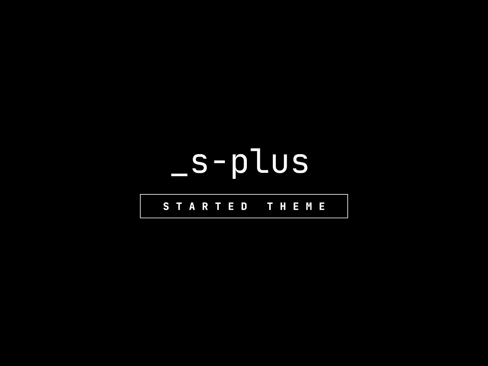

_s-plus
=======
<p>

</p>

¡Hola!, soy un tema para WordPress llamado `_s-plus`. Lo sé, soy muy parecido a `_s` o también `underscore`, y esto es así porque estoy basado en él, pero con muchas funcionalidades extras que una vez conozcas podrán ahorrarte tiempo valioso.

La idea detrás de este tema es ser una base sólida para creación de temas personalizados en conjunto con ACF. No intenta dar un estilo preestablecido, ni marcar algún tipo de tendencia gráfica. Cuando lo instales notaras que en el aspecto visual prácticamente está en blanco.

Estas son las funcionalidades más destacadas:

* Flujo de trabajo automatizado con `gulp`; listo para usar.
* Estructura de archivos optimizada.
* Mejoras en el manejo de imágenes.
* Configuraciones generales accesibles.
* Plantilla para agregar opciones al `customizer`.
* Funciones utilitarias para el `WP Loop`.
* Fácil implementación de ACF (Gutenberg Blocks y Flexible Content).
* Integración de grid CSS básica.
* Menu responsive totalmente funcional.
* Mejoras de accesibilidad.
* Utilidades para SASS/CSS.

Instalación
------------

### Requerimientos

`_s-plus` requiere de las siguientes dependencias:

- [Node.js](https://nodejs.org/)

### Configuración

Para comenzar a usar todas las herramientas que vienen con `_s-plus`, debe instalar las dependencias necesarias de Node.js:

```sh
$ npm install
```

### Inicio rápido

Clone o descargue este repositorio, cambie su nombre por otro (como, digamos, `theme-name`), y luego debes buscar y reemplazar el nombre en todas las plantillas. Puedes hacerlo de dos maneras: la semi-automatica y la manual. La semi-automatica consiste en ir al archivo `gulpfile.js` y establecer en el parámetro `slug_theme` el **Text Domain** del tema. Ahora, en la terminal(ya con todas las dependencias instaladas), ejecuta:

```sh
$ gulp replace_slug_theme
```

El método manual consiste en que busques y reemplaces en seis pasos el nombre, asegurándote que la sensibilidad de mayúsculas/minúsculas esté activada.

1. Busque `'_s_plus'` (dentro de comillas simples) para capturar el dominio de texto y reemplácelo con `'theme-name'`.
2. Busque `_s_plus_` para capturar todos los nombres de funciones y reemplácelos con: `theme_name_`.
3. Busque `Text Domain: _s_plus` en `style.css` y reemplácelo con `Text Domain: theme-name`.
4. Busque ` _s_plus` (con un espacio antes) para capturar DocBlocks y reemplácelo con `theme_name`.
5. Busque `_s_plus-` para capturar identificadores prefijados y reemplácelos con: `theme-name-`.
6. Busque `_S_PLUS_` (en mayúsculas) para capturar constantes y reemplace con: `THEME_NAME_`.

Opcionalmente, para el prefijo de las utilidades, reemplace `sp_` por `theme_name_`.

## Caracteristicas

### Tareas automatizadas con gulp

`_s_plus` viene con un conjunto de tareas listas para que funcionen casi al instante.

Solo edita el archivo `gulpfile.js` busca el apartado **BASIC SETUP** y establece en el parámetro `urlBrowserSync` la URL del servidor local de tu proyecto. Los demás campos son opcionales; siéntete libre de editarlos a tus necesidades.

**De manera general estas son las tareas:**

* SASS/CSS: compila, optimiza y minifica.
* JS: Concatena todos los scripts, transforma ES6 a ES5 con Babel 8 y los minifica. Para agregar más scripts abre `gulpfile.js` y busca el apartado **`JS TASK`**. Hay dos arrays `vendors` y `customs`. Los que esten en `vendors` solo concatenara los scripts, en los que estan en `customs` analizara el JS con Babel.
* ICONS: Al agregar iconos `.svg` al directorio `assets/icons` se genera automáticamente una hoja de estilo para uso.
* AUTO-RELOAD: Inyecta CSS automáticamente, recarga el navegador al guardar los archivos de plantillas `.php`.
* AUTO-IMPORT: No te preocupes de estar pendiente de importar manualmente cada nuevo archivo `.scss`. Esta tarea genera de manera automática los`import` de todos los archivos que están dentro de determinados directorios. Los directorios son: `/assets/scss/blocks`, ` /assets/scss/components` y `/assets/scss/site`.

### Estructura de archivos mejorada

Aunque este punto puede ser subjetivo, ***menos siempre es más***. Se han reorganizado los archivos con el fin de facilitar la búsqueda de las opciones comunes. A veces es abrumador tener lleno el directorio raíz del tema, es por eso que los archivos generales de plantilla de jerarquía de Wordpress(single.php, page.php, 404.php, etc.) están dentro de la carpeta `/template-parts` ; todo sigue funcionando como se debe porque el archivo `index.php` en la raíz del tema, redirige a la plantilla adecuada. Si no te gusta esto, solo regresa los archivos al directorio raíz y listo. El funcionamiento de jerarquía de plantillas de WordPress se comporta sin diferencias.

### Compatibilidad con `smoothScroll`

Al momento de escribir esto, la mayoría de los navegadores modernos tiene soporte nativo para smooth-scroll (no confundir con smoothScrollBar), pero para los que no, se ha agregado un polyfill para solucionarlo. Si deseas un offset para compensar el uso de menú sticky(claro, si lo usas), en el archivo  `/assets/js/main.js` ubica la sección `● SMOOTH SCROLL` y cambia la variable **`offset`** con el número de píxeles necesarios. Esto por defecto esta desactivado.

### Mejoras en el manejo de imágenes.

Entre las mejoras están:

1. Empleo de [vainilla-lazyload library](https://github.com/verlok/vanilla-lazyload) para la carga de imagenes. Actualmente, la mayoría de los navegadores soportan lazyload atributo, pero `vainilla-lazyload` library demuestra un mejor rendimiento.
2. Utilización de imágenes responsivas por medio de la función `sp_resp_img`. Ahora algunas notas a consideración sobre esta función:
   * Esta permite generar una [imagen con marcado responsive](https://developer.mozilla.org/en-US/docs/Learn/HTML/Multimedia_and_embedding/Responsive_images) dado ID y tamaño de imagen.
   * Si `vainilla-lazyload` library está activo en la cola de scripts de WP, entonces se acoplara para que funcione sin problemas.
   * Puede ser utilizada en el `WP Loop` sin necesidad de especificar el ID de la imagen; por defecto, obtendrá la imagen destacada de la publicación actual dentro del WP loop.
   * Esta función maneja errores comunes. Si el ID de imagen no existe, se generara una imagen placeholder; si el ID es correcto, pero el tamaño de imagen pasado no, por defecto se tomara un tamaño valido, en este caso `large`.
3. Se han deshabilitado el escalado de imágenes predeterminado de WordPress. Un poco de contexto: Desde WordPress 5.3 las imágenes mayores a `2560px`, se reescalan automáticamente y se le asigna el pos-fijo `scaled`. Esta imagen en la BD se utiliza para el tamaño de imagen `full`. Aunque parece buena idea, la funcionalidad por defecto conserva la imagen original aunque nunca más sea usada, lo cual no es lo que la mayoria de los casos necesita.
4. Se ha añadido de forma compacta la funcionalidad de [Imsanity plugin](https://es.wordpress.org/plugins/imsanity/). Su función básica es re-escalar automáticamente imágenes mayores a `2000px` de ancho. Si se detecta que el plug-in `Imsanity` está activo, se dará prioridad a dicho plug-in para evitar conflictos.
5. Se han desactivado los tamaños de imagen intermedios('1536x1536', '2048x2048'), los cuales es posible que no los emplees, ni sepas que se generan. Puedes volverlos a activar si deseas.

### Fácil configuración

Se han dividido las configuraciones comunes de WordPress (widgets, tamaños de imágenes, menús, estilos y scripts) en archivos individuales, para evitar perdernos en el código y ser más fácilmente accesibles. Ve a `/includes/base/`; comprueba tu mismo.

### Implementación rápida de customizer

El tema trae una plantilla de configuración para agregar campos al customizer. Ve a `includes/features/settings_customizer.php`. De forma predeterminada, la inclusión de ese archivo está deshabilitado; habilítalo en `functions.php` en el apartado *●❱ CUSTOMIZER*.

### Funciones utilitarias

En el día a día hay tareas repetitivas que se hacen mejor con funciones para mejorar la legibilidad y el mantenimiento del código. Son pocas, pero muy utiles.

* **sp_img_resp()** Genera un elemento HTML de imagen completo con notación responsiva, dado el tamaño de imagen e ID. El ID no es obligatorio, se tomará el ID del elemento actual dentro del WP loop.
* **sp_get_img__url()** Obtiene la URL de imagen dado un ID y tamaño de imagen. ID no es obligatorio, se tomará el ID del elemento actual dentro del WP loop.
* **sp_get_img__alt()** Obtiene el texto alternativo de una imagen dado el ID. ID no es obligatorio, se tomará el ID del elemento actual dentro del WP loop
* **sp_get_cat__name()** Obtiene el nombre de la primera categoría asignada al post actual dentro del WP loop.
* **sp_get_cat__url()** Obtiene la URL de la primera categoría asignada al post actual dentro del WP loop.
* **sp_the_excerpt()** Obtiene el extracto de la publicación actual dado un límite de palabras.
* **sp_get_asset()** Obtiene la ruta del recurso especificado, ubicado en `/assets/img/`.

### Uso con Advanced Custom Fields(ACF)

El tema está listo para usar **`flexible content`** y **`acf blocks`**, juntos o separados. Además trae ejemplos de componentes y bloques para un rápido comienzo. Es necesario tener el plug-in ACF Pro instalado y sincronizar los archivos JSON para poder ver los grupos de campos personalizados en el panel de administración de ACF.

De forma predeterminada los dos métodos de construcción están activados. Si solamente deseas utilizar un método, por orden y comodidad puedes eliminar el otro.

* **Dejar solamente ACF Blocks**

Elimina la carpeta `/ACF/flexible-content/`, y los siguientes archivos: `/ACF/acf-generate-layout.php` y `/ACF/acf-generate-page.php`.

* **Dejar solamente flexible content**

Elimina la carpeta `/ACF/blocks`. Ahora en el archivo `/includes/features/acf.php` cambia la constante `ACF_ONLY_CP` a `true`.

#### Notas sobre flexible content

De modo predeterminado, la estructura para **`flexible content`** es anidada; consta primero de columnas y luego componentes (`Add column > Add component`). Dicha estructura es útil para composiciones complejas. Si solo deseas emplear el enfoque clásico donde se añaden componentes directamente (`Add component`) entonces necesitas hacer unos pequeños cambios para adaptarlo.

1. Ir al admin de grupos de campos de ACF y borrar o desactivar el grupo `[BUILDER] LAYOUT`.
2. Entrar al grupo de campos `[BUILDER] PAGE`, y activarlo. Por defecto se muestra en las páginas.
3. En `/includes/features/acf.php` establece la constante `ACF_NESTED` en `false`.

### Grid layout

Trae integrada un sistema grid CSS basado en Boostrap, pero mucho más compacto.

### Menú responsivo

No necesitas invertir mucho tiempo en hacer el menú responsivo. Únicamente agrega elementos al menú principal y prácticamente estará listo. Viene preparado para hasta tres niveles de profundidad. Si necesitas cambiar el breakpoint del menú, ve a `/assets/scss/site/header.scss` y cambia la variable **`$breakpoint_menu`**.

### Mejoras de accesibilidad

* Incluye el enlance **Skip to Content**
* Menú y sub menús del header accesibles desde teclado.
* Menú móvil acondicionado para una mejor experiencia.
* Correcto etiquetado de elemento H1. En homepage el elemento H1 es el nombre del sitio, en el resto no.

### Ayudantes de SASS

`_s_plus` incluye una serie de mixins que una vez entiendas como utilizar el proceso será más rápido. Estos son algunos de los más relevantes:

* **interpolate:** Permite emplear propiedades responsivas. Entre sus características están:
  * Maneja diferentes unidades (`rem, em o px`).
  * Soporta usar la propiedad `!important`.
  * Permite emplear unidades negativas.
  * Permite utilizar variables CSS en vez de una propiedad.
  * Incluye la corrección para el funcionamiento en Safari.
  * Conversión automática de unidades en mediaquerys a `em` [Vea el motivo aquí.](https://zellwk.com/blog/media-query-units/)
  * Uso de shorthands. Por ejemplo: font-size, margin(con todas sus variantes), padding(con todas sus variantes) y rfs; esta última para cualquier otra propiedad.
* **m_query:** Permite crear mediaquerys de forma más rápida.
  * Por defecto las mediaquerys son de tipo `max-width`.
  * Acepta `rem, em o px`.
  * Convierte automáticamente el breakpoint a `em`. [Vea el motivo aquí.](https://zellwk.com/blog/media-query-units/)
  * Resta .02 pixel a las mediaquery por defecto, para evitar superposición de pantallas. [Vea más detalles aquí.](https://getbootstrap.com/docs/5.2/layout/breakpoints/#max-width)
